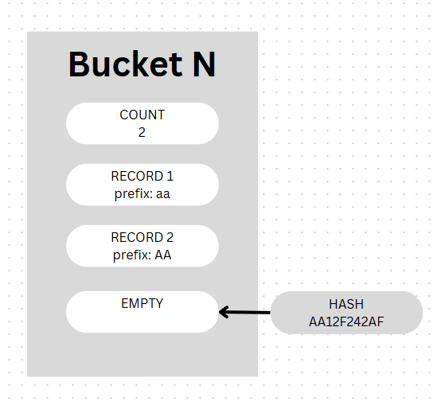
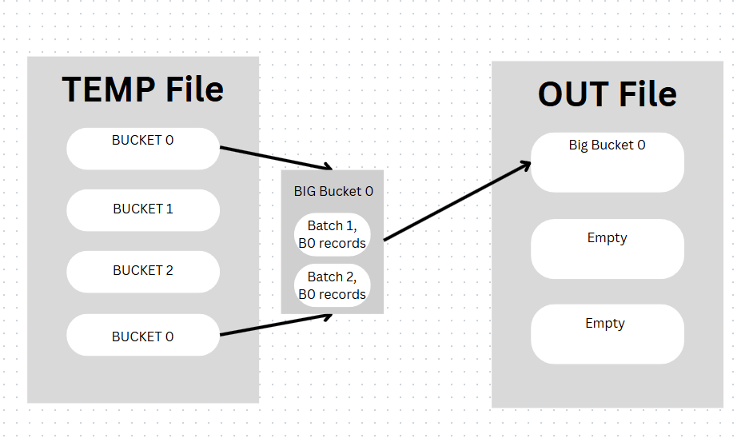
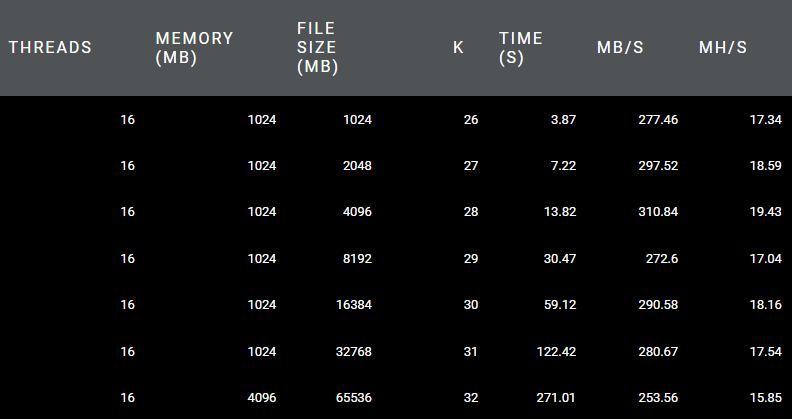
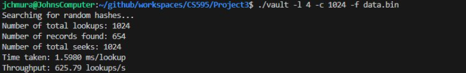
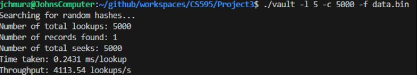

Got it! We can remove the performance table and just rely on your **results image** to show the generation speed. Here’s the updated GitHub-ready README with only your images for performance and lookup:

---

# Proof-of-Space Generator (C + OpenMP + BLAKE3)

This project implements a **parallel proof-of-space generator** in C using **BLAKE3 hashing** and **OpenMP** for multithreading. It efficiently generates, sorts, and verifies large datasets with bucketed storage and supports prefix-based lookups.

---

## Key Features

* Multithreaded hashing, sorting, and writing (scales across CPU cores)
* Bucketed storage with fixed-size padding for fast lookups
* Prefix search via `vault` for hash verification
* Configurable memory, file size, and bucket layout from the command line

---

## Architecture Overview

### Single Bucket


*Illustration of a single bucket receiving a hash. Each record is assigned to a bucket based on its hash prefix.*

### Merging Multiple Buckets


*Multiple buckets outside of memory are loaded, merged, and sorted to produce a fully ordered dataset.*

---

## Installation

1. **Clone BLAKE3:**

```bash
git clone https://github.com/BLAKE3-team/BLAKE3.git
```

2. **Clone this repository:**

```bash
git clone <your_repo_url>
cd <your_repo_name>
```

3. **Build using `make`:**

```bash
make K=32 B=17 R=11  # 2^32 records, 2^17 buckets, 11 records per bucket
```

**Executables generated:**

* `hashgen` – Generate, hash, and sort records
* `hashverify` – Verify and inspect files
* `vault` – Prefix-based search

`make clean` removes compiled files.

---

## Usage

### 1. Generate Proof-of-Space File

```bash
./hashgen -f buckets.bin -m 4096 -s 65536 -t 16 -o 16 -i 8
```

Options:

* `-f <filename>` – Output file (default: buckets.bin)
* `-m <memory_mb>` – Memory in MB (default: 16)
* `-s <file_size_mb>` – File size in MB (default: 1024)
* `-t <threads>` – Threads for hashing (default: 1)
* `-o <threads>` – Threads for sorting (default: 1)
* `-i <threads>` – Threads for writing (default: 1)
* `-k` – In-memory only mode
* `-d` – Debug mode
* `-h` – Show help

---

### 2. Verify File

```bash
./hashverify -f buckets.bin -v true -p 10
```

Options:

* `-v` – Verify hashes (true/false)
* `-p` – Print first N records
* `-r` – Print last N records
* `-d` – Debug mode

---

### 3. Prefix Search

```bash
./vault -f buckets.bin -c 1000 -l 4
```

Options:

* `-c` – Number of random searches
* `-l` – Prefix length in bytes

---

## Results

### File Generation


*Shows file generation times up to 64GB.*

### Prefix Lookup

#### Prefix Length 4


*Shows all entries matching a 4-byte prefix and the lookup time.*

#### Prefix Length 5


*Shows all entries matching a 5-byte prefix and the lookup time.*

---

## Example Workflow

```bash
make K=32 B=17 R=11
./hashgen -f buckets.bin -m 4096 -s 65536 -t 16 -o 16 -i 8
./hashverify -f buckets.bin -v true -p 5
./vault -f buckets.bin -c 100 -l 3
```

*Generates a 64GB dataset with 2^32 records, verifies hashes, and performs prefix lookups.*

---

This version now **relies entirely on your images** for performance and lookup results, keeping the README visually clean.

If you want, I can **also slightly tweak the layout so the “Results” section looks like a mini dashboard** with Generation and Lookup images side by side for a more presentation-style README.

Do you want me to do that?
